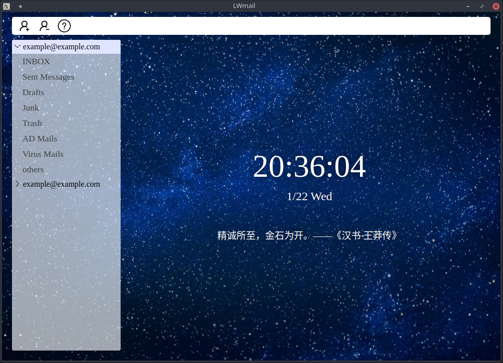

# LWmail

[English](../readme.md)

**一切都处于初始阶段**

**LWmail**: 一个简洁、跨平台、集成的邮件客户端，能够帮助你从浩瀚的邮件客户端中脱颖而出。



## 为什么我们要开发LWmail？

每个人手中的邮件数量在不断增加，而且它们来自不同的邮件服务提供商。对统一管理和实时提醒的需求越来越大。与此同时，市场上大多数邮件客户端已停止维护，或者功能冗余，需要一个清晰、集中的邮件客户端，拥有简洁的界面。

**梭哈是一种智慧**

## 支持

LWmail是使用Electron构建的，具有出色的跨平台特性。你可以在Linux、Windows、macOS以及任何支持Electron的平台上使用LWmail。

## 如何添加新邮箱账户？

有关详细信息，请参见指南：[Guide: How to add a new email account](add-new-account.md)。

## 开发者专区

### buildjs

```bash
yarn install
npm run buildjs
```
