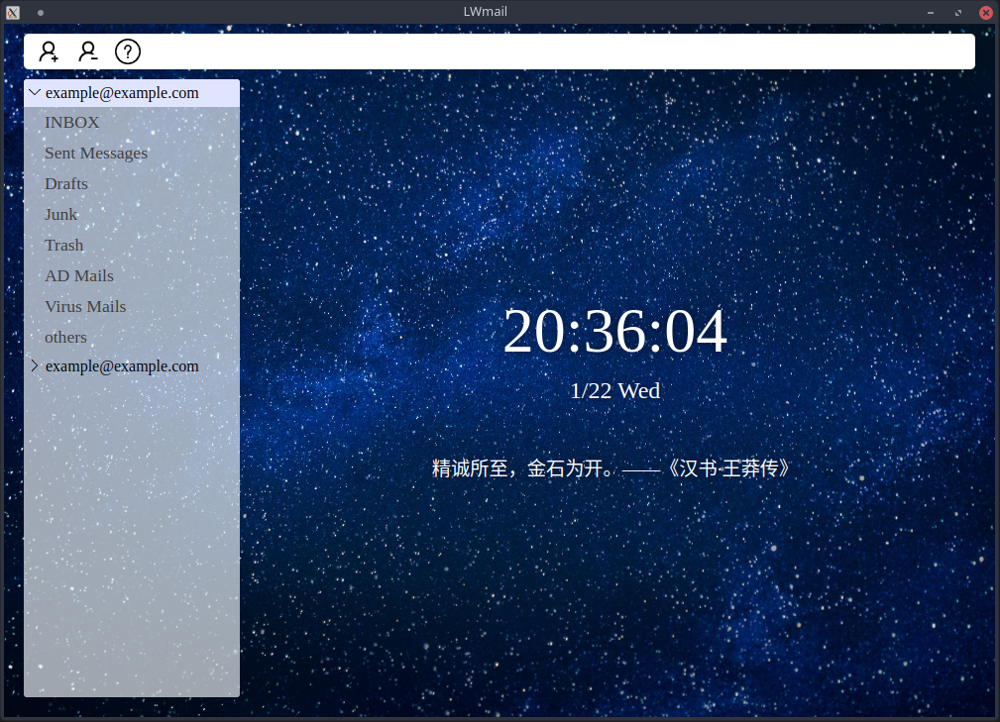

# LWmail

[简体中文](doc/readme_zh_CN.md)

**Everything is in the initial stage**

**LWmail**: A concise, cross-platform, and integrated email client, which can rescue you from the vast sea of email clients.



## Why do we want to develop LWmail?

The number of emails in everyone's hands is increasing, and they all come from different email providers. The demand for unified management and real-time reminders is growing. At the same time, most email clients on the market have stopped maintenance or have redundant functions, and there is an urgent need for a clear and centralized email client with clear pages.

**all-in-one is a kind of wisdom**

## Support

LWmail is built using Electron and has excellent cross platform features. You can use LWmail on Linux, Windows, macOS, and any platform that supports Electron

## How to add a new email account?

See [Guide: How to add a new email account](doc/add-new-account.md) for details.

## for developers

### buildjs

```bash
yarn install
npm run buildjs
```
